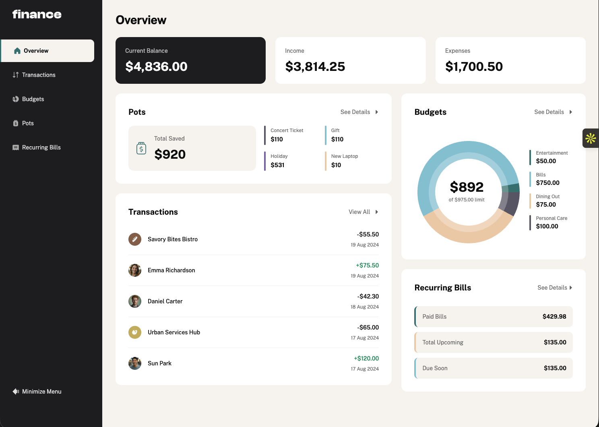
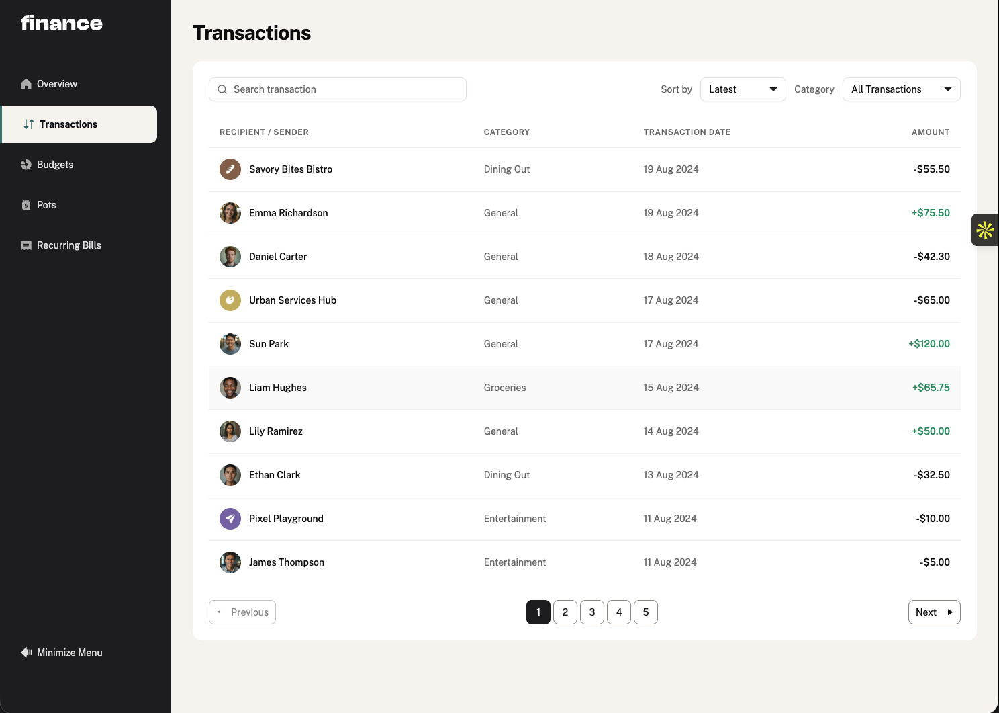
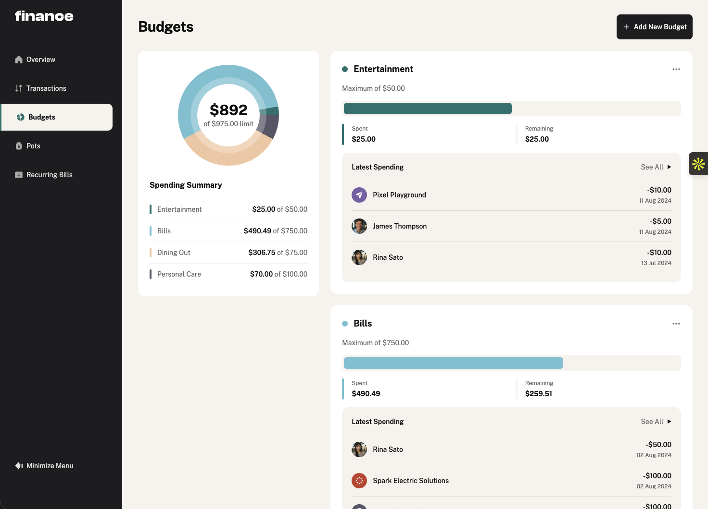

# Personal Finance App

A full-stack personal finance dashboard for tracking transactions, budgets, saving pots, and recurring bills. Built from the [Frontend Mentor Personal Finance App challenge](https://www.frontendmentor.io/challenges/personal-finance-app-JfjtZgyMt1), extended with user authentication, a PostgreSQL database, and a REST API.

## Live Demo

| | URL |
|---|---|
| **App** | [finance-poxg.onrender.com](https://finance-poxg.onrender.com/) |
| **API docs** | [finance-api-6sw6.onrender.com/docs](https://finance-api-6sw6.onrender.com/docs) |

## Screenshots

### Overview



### Transactions



### Budgets



## Features

- **Overview** — current balance, income, and expenses at a glance, plus widgets for pots, transactions, budgets, and recurring bills
- **Transactions** — paginated list with search, sort, and category filtering
- **Budgets** — create, edit, and delete budgets with spending charts and latest category transactions
- **Pots** — savings goals with add/withdraw actions and progress tracking
- **Recurring bills** — track paid, due soon, and upcoming bills for the month
- **Authentication** — sign up, log in, password recovery, and user settings
- **Responsive UI** — mobile-first layout with light and dark mode

## Tech Stack

| Layer | Technologies |
|---|---|
| **Frontend** | React, TypeScript, Vite, TanStack Router, TanStack Query, Tailwind CSS, shadcn/ui, Recharts |
| **Backend** | FastAPI, SQLModel, PostgreSQL, Alembic, JWT |
| **Tooling** | Docker Compose, Playwright, GitHub Actions |

## Getting Started

### Prerequisites

- [Docker](https://docs.docker.com/get-docker/) and Docker Compose

### Run locally

From the project root:

```bash
docker compose watch
```

Once the stack is up:

| Service | URL |
|---|---|
| Frontend | http://localhost:5173 |
| Backend API | http://localhost:8000 |
| Swagger UI | http://localhost:8000/docs |
| Adminer (DB) | http://localhost:8080 |

The first startup may take a minute while the database initializes and migrations run. Check progress with:

```bash
docker compose logs -f backend
```

### Environment

Copy and configure `.env` before deploying. At minimum, change `SECRET_KEY`, `FIRST_SUPERUSER_PASSWORD`, and `POSTGRES_PASSWORD` from their defaults.

Generate a secret key:

```bash
python -c "import secrets; print(secrets.token_urlsafe(32))"
```

## Development

- [development.md](./development.md) — local workflow, running services individually, and testing
- [backend/README.md](./backend/README.md) — backend setup, migrations, and tests
- [frontend/README.md](./frontend/README.md) — frontend dev server and client generation
- [deployment.md](./deployment.md) — production deployment with Docker Compose and Traefik

## Project Structure

```
├── backend/          # FastAPI API, models, and migrations
├── frontend/         # React SPA
├── compose.yml       # Docker Compose stack
├── development.md
└── deployment.md
```

## Acknowledgments

- UI design from [Frontend Mentor](https://www.frontendmentor.io)
- Project scaffolding from the [Full Stack FastAPI Template](https://github.com/fastapi/full-stack-fastapi-template)

## License

MIT
